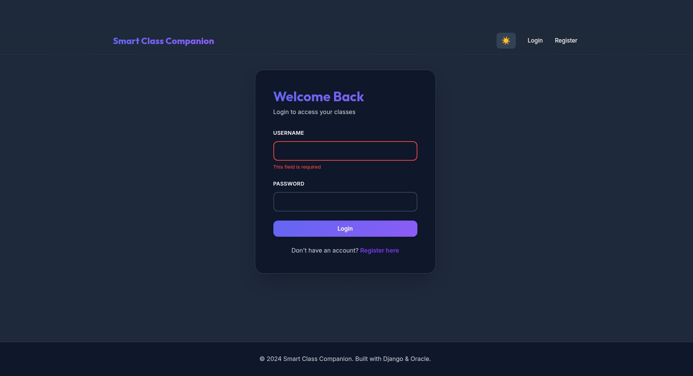

# Smart Class Companion ccc



A comprehensive Classroom Management System built with Django and Oracle Database.

## Overview
Smart Class Companion is a web application designed to facilitate interaction between teachers and students. It allows teachers to create classes, post lessons, assign homework, and grade submissions, while students can join classes, access materials, submit work, and ask questions.

## Feature
*   **Role-Based Access Control**: Distinct interfaces for Teachers and Students.
*   **Class Management**: Create, edit, and archive classes. Enroll students via unique class codes.
*   **Lesson Planning**: Organize content into lessons with file attachments (PDF, PPT, etc.).
*   **Assignment System**: Create assignments with due dates, accept file submissions, and provide grading/feedback.
*   **Q&A Module**: Contextual Q&A threads attached to specific lessons.
*   **Teacher Dashboard**: Analytics on student enrollment, pending grading, and recent activity.
*   **Student Dashboard**: Overview of upcoming deadlines, missing work, and recent lessons.

## Tech Stack
*   **Backend**: Django 4.2 (Python 3.13)
*   **Database**: Oracle Database 18c XE (Dockerized)
*   **Containerization**: Docker & Docker Compose
*   **Frontend**: Bootstrap 5, Custom CSS

## Prerequisites
*   Docker
*   Docker Compose

## Quick Start

1.  **Start the Application**:
    Run the helper script to build and start the containers:
    ```bash
    ./docker-start.sh
    ```
    *Note: The first run may take a few minutes as the Oracle Database initializes and creates the user.*

2.  **Access the App**:
    Open your browser to [http://localhost:8000](http://localhost:8000).

3.  **Default Admin Credentials**:
    *   **Username**: `admin`
    *   **Password**: `adminpass`
    *   **Admin Panel**: [http://localhost:8000/admin](http://localhost:8000/admin)

## Database Configuration

The application uses an **Oracle Database 18c XE** container.
*   **Service Name**: `xepdb1`
*   **User**: `smartclass_user`
*   **Password**: `smartclass_pass`
*   **Port**: `1521` (Mapped to host)

To connect to the database from your host machine (e.g., using DBeaver or SQL Developer):
*   **Host**: `localhost`
*   **Port**: `1521`
*   **Database/Service**: `xepdb1`
*   **Username**: `smartclass_user`
*   **Password**: `smartclass_pass`

## Running Tests

The project includes a comprehensive test suite covering all workflows and CRUD operations.

To run the tests inside the container:
```bash
docker compose exec web python manage.py test core
```


## Project Structure
```
smart-class-companion/
├── core/                   # Main application app
│   ├── models.py           # Database models
│   ├── views.py            # View logic
│   ├── urls.py             # App URLs
│   ├── forms.py            # Forms
│   ├── tests_workflows.py  # End-to-end workflow tests
│   └── tests_crud.py       # CRUD operation tests
├── smartclass/             # Project configuration
│   ├── settings.py         # Django settings (Oracle config here)
│   └── urls.py             # Main URL routing
├── Dockerfile              # Web container definition
├── docker-compose.yml      # Service orchestration
└── requirements.txt        # Python dependencies
```
